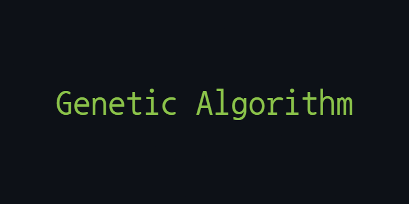
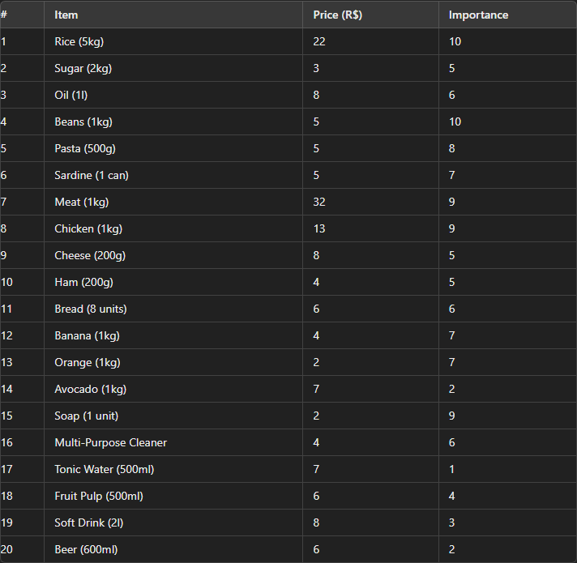

<p align="center">
  
</p>

## Overview
- This project implements a genetic algorithm to choose the best combination of items from a shopping list
- The goal is to maximize the total importance of the items selected without exceeding a budget of R$ 75.00
- Built with Python

<p>This project was developed during my Artificial Intelligence course in college.

## Problem Description

- Tiago went to the supermarket with R$ 75.00 and a shopping list of 20 items
- Due to the prices and his limited budget, he realized he couldn't buy everything
- To make better decisions, Tiago rated each item on a scale of 1 to 10 based on how much he needed it, with 1 being the least necessary and 10 being the most necessary

<p>Here is the list of items along with their prices and importance ratings:
<p align="center">
  
</p>

## Solution
- The goal of the algorithm is to find the best combination of items that maximizes the total importance while staying within the R$ 75.00 budget

## Key Components of the Algorithm

- **Crossover**
<p>The crossover rate determines whether a crossover will occur or if the offspring will be clones of the parents.
<p>A one-point crossover is used, where a random point in the chromosome is chosen to split it. 
<p>The first part of chromosome 1 is combined with the second part of chromosome 2, and vice versa, to form the offspring.
  
- **Mutation**
<p>Mutations occur in the genes of a chromosome based on the mutation rate.

- **Fitness Function**
<p>The fitness function sums the total price and importance of each chromosome.
<p>The fitness score is zero if the total price exceeds the maximum budget.
<p>Otherwise, the fitness score equals the total importance.

- **Selection**
<p>Parent selection is performed using roulette selection, where the fitness value of each chromosome gives it a selection advantage.

## Implementation Strategy
1. **Chromosome Generation**: Initial chromosomes are generated.
2. **Population Generation**: A population of chromosomes is created.
3. **Parent Selection**: Parents are selected using roulette selection.
4. **Crossover**: Crossover is performed to generate offspring.
5. **Mutation**: Offspring undergo mutation.
6. **Iteration**: The process continues until a population of 100 chromosomes is generated.

- Mutation Rate: 0.01
- Crossover Rate: 0.8
- Maximum Generations: 100

## Installation and Usage
To compile and run this project, follow these steps:
1. Install Python
2. Clone the repository:
   ```bash
   git clone https://github.com/GiuliaFreulon/genetic-algorithm
   cd genetic-algorithm
3. Run the program:
   ```bash
   python main.py

## License
This project is licensed under the MIT License. See the [LICENSE](LICENSE) file for details.
